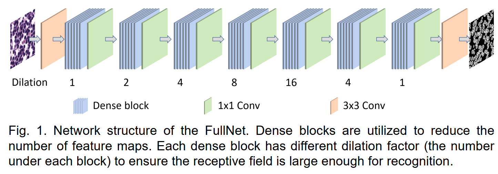
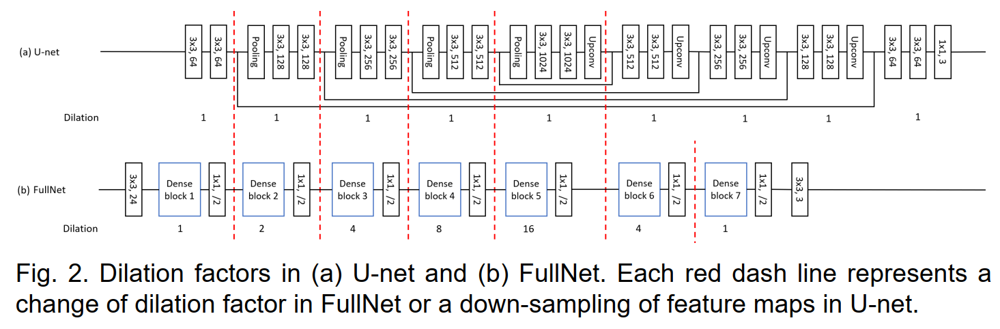
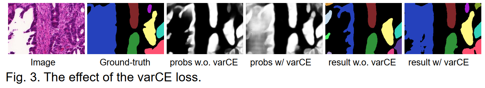
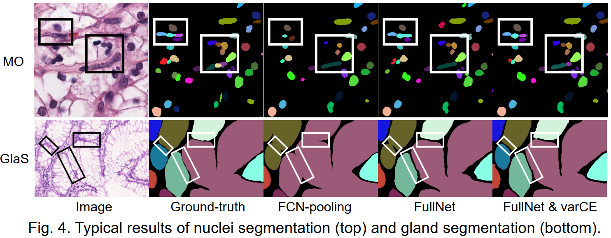
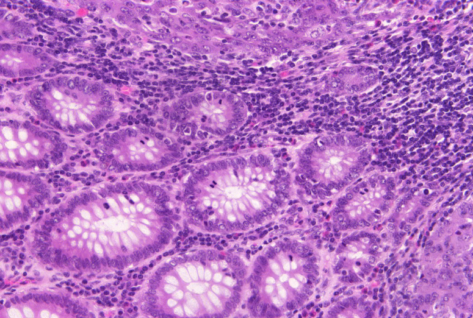
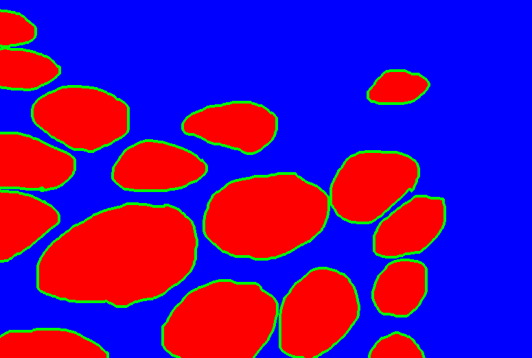
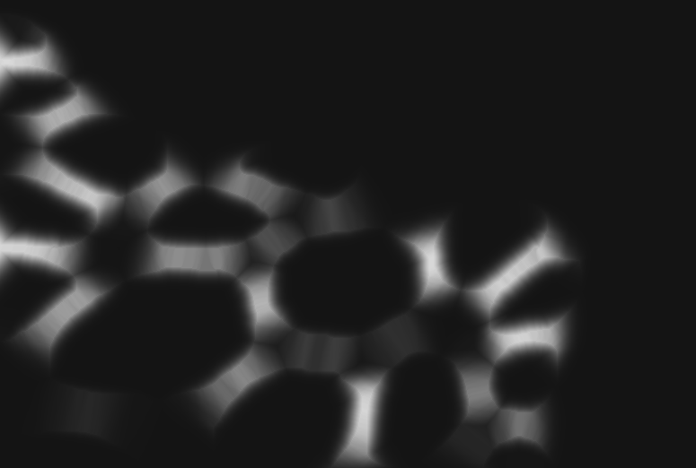
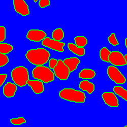
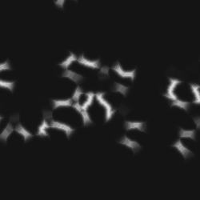

# FullNet and varCE loss for gland/nuclei segmentation

This repository contains the pytorch code for the paper:

Improving Nuclei/Gland Instance Segmentation in Histopathology Images by Full Resolution Neural Network
and Spatial Constrained Loss, MICCAI2019. ([PDF](https://doi.org/10.1007/978-3-030-32239-7_42))

If you find this code helpful, please cite our work:

```
@inproceedings{Qu2019miccai,
    author = "Hui Qu, Zhennan Yan, Gregory M. Riedlinger, Subhajyoti De, and Dimitris N. Metaxas",
    title = "Improving Nuclei/Gland Instance Segmentation in Histopathology Images by Full Resolution Neural Network and Spatial Constrained Loss",
    booktitle = "Medical Image Computing and Computer Assisted Intervention -- MICCAI 2019",
    year = "2019",
    pages = "378--386",
}
```

## Introduction

The networks and cross entropy loss in current deep learning-based segmentation methods originate from image 
classification tasks and have two main drawbacks: (1) pooling/down-sampling operation eliminates the details in 
feature maps, and (2) cross entropy loss only cares about individual pixels. To solve these problems, in this paper
we propose a full resolution convolutional neural network (FullNet) that maintains full resolution feature maps to 
improve the localization accuracy. We also propose a variance constrained cross entropy (varCE) loss that encourages 
the network to learn the spatial relationship between pixels in the same instance. Experiments on a nuclei segmentation 
dataset and the 2015 MICCAI Gland Segmentation Challenge dataset show that the proposed FullNet with the varCE
loss achieves state-of-the-art performance.










## Dependecies
Ubuntu 16.04

Pytorch 0.4.1

Python 3.6.6

SimpleITK 1.1.0

## Usage

### Data preparation
Before training, you need to prepare the training images and labels. We use ternary labels and weight maps to 
help separate close instances. Here are two examples for the image/ternary_label/weight_map pairs in GlaS and MultiOrgan 
datasets.

| Image | Ternary label | Weight map |
| ---|-----| ------ |
|  |  |  |
|  |  |  |


The steps to prepare these files are:
* Download the gland dataset ([link](https://warwick.ac.uk/fac/sci/dcs/research/tia/glascontest/download/)) or the
Multi-Organ dataset ([link](https://nucleisegmentationbenchmark.weebly.com/dataset.html))
  
  **Note**: I just found that the authors of the Multi-Organ dataset replaced some images in the dataset
in September 2019. Therefore the current dataset is different from what I used for experiments. As a result,
we put the original dataset [here](https://drive.google.com/drive/folders/1LQQIGLNg5vMELtLD4UJdDT2OjTMZMlcn?usp=sharing) 
(`Tissue Images.zip` and `Annotations.zip`) for your reference. The color normalized images and instance labels are also included in the folder. In the instance 
labels, each pixel belongs to exactly one nucleus. We didn't consider the overlapped parts during experiments.

* For MultiOrgan dataset, generate the instance labels from the .xml annotation files. Use uint16 instead of 
uint8 to assign a unique integer for each nucleus.

* Generate the ternary label from each instance label using `create_ternary_labels` method in `prepare_data.py`.

* Compute the weight map from each instance label using `weight_map.m`.

* For MultiOrgan dataset, perform color normalization in all images to reduce the color variance using `color_norm` 
method in `prepare_data.py`.

* For MultiOrgan dataset, split each large training image/label/weight_map into 16 small 250x250 patches 
using `split_patches` method in `prepare_data.py`


### Model training and test
To training a model, set related parameters in the file `options.py` and run `python train.py`, or run the script
`sh scripts/run_GlaS.sh`

The pretrained FullNet-varCE models can be downloaded from [model_MultiOrgan](https://drive.google.com/file/d/1ucCwmTVrRd3TfJGWn8LnPznXhG0-zLAB/view?usp=sharing) 
and [model_GlaS](https://drive.google.com/file/d/1twgkHrWHMhPMVWzgvg4JFRkQ5PIgTR3-/view?usp=sharing).

To evaluate the trained model on the test set, set related parameters in the file `options.py` and 
run `python test.py`. You can also evaluate images without ground-truth labels by simply setting
`self.test['label_dir']=''` in the file `options.py` and run `python test.py`.